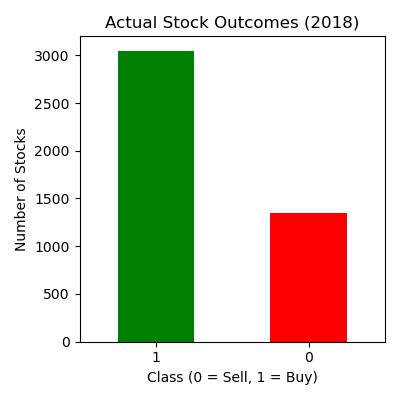
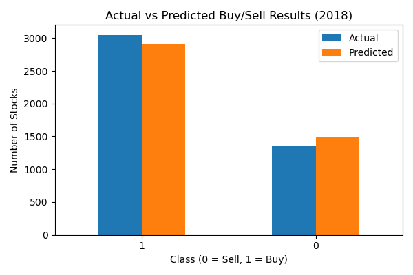
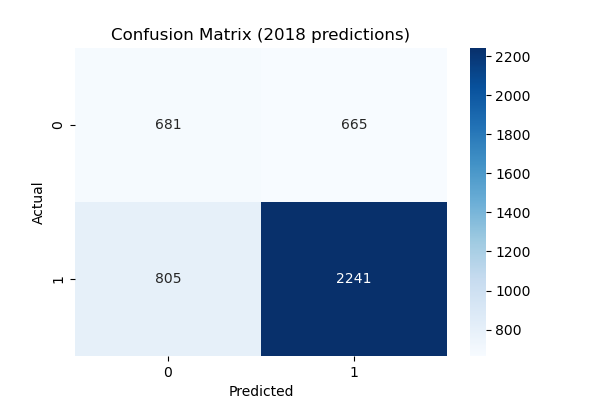
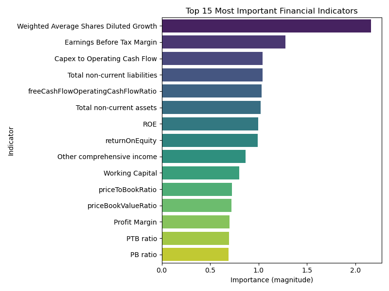
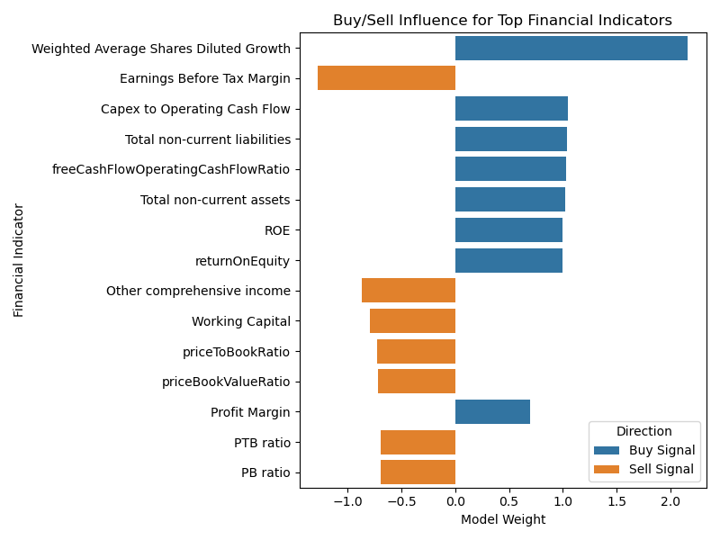
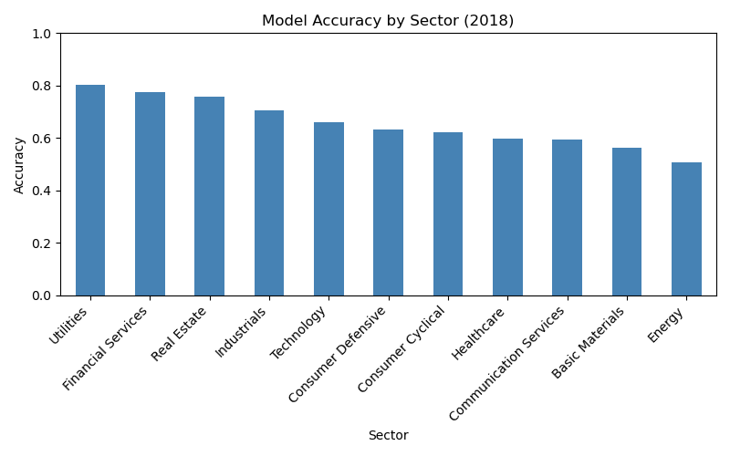

### Goal:

##### Can financial indicators from 10-K filings be used to predict whether a stock will outperform the market over the following year?

As someone interested in applying math and computer science to the financial industry, I thought it would be appropriate to analyze financial data and create a stock indicator using fundamental analysis. The algorithmic trading industry has invested billions into data infrastructure and research, aiming to consistently outperform the stock market. However, many of these strategies fail, and the question always seems to be, is it smarter to simply buy the S&P 500 rather than picking stocks yourself as a retail investor? I decided to use what we have learned in this class to determine if fundamental financial data alone can meaningfully predict stock performance.

### Description of Dataset and Preparation:

This project uses financial indicators extracted from corporate 10-K filings to determine whether a stock will increase or decrease in value over the following year. Using a data set of over 4,000 U.S. stocks and more than 200 financial indicators, I applied machine learning techniques to classify stocks as potential buy or sell candidates.
The dataset was sourced from Kaggle and contains annual financial data for U.S. publicly traded companies from 2014 to 2018 [Kaggle Financial Data](https://www.kaggle.com/datasets/cnic92/200-financial-indicators-of-us-stocks-20142018?resource=download&select=2018_Financial_Data.csv). Each row represents a company in a given year, and each column represents a financial indicator commonly found in 10-K filings. There were five CSV files (2014, 2015, 2016, 2017, and 2018), each containing data for the given year, which I consolidated and used as training and test data while removing certain columns that would corrupt our predictions. Data from 2014-2017 would act as our training, and 2018 would be our test.

### Preventing Data Leakage:

I removed columns that would leak future information, such as “Class”, which was a binary target variable that stated whether the stock price increased or decreased the following year, as well as future price variation “Price Var [%]”, and the year label. Company identifiers were also excluded from the set. This ensures that the model only had access to information that would have been known at the time of prediction.

### Handling Missing Values and Scaling:

Some of the indicators held missing values, and instead of discarding large portions of the data, I filled missing values with the average of each indicator from the training set. Although this might alter some of the predictions in the end, it was a better alternative than discarding a company entirely for missing a single data point.
Since financial indicators vary significantly in scale, all of the features were standardized using z-score normalization. This was critical to make sure that no single variable overpowers the model due to numerical size.

### Machine Learning Model:

I used a logistic regression classifier as it is appropriate for binary classification tasks and allows us to understand which financial indicators influence predictions, as opposed to a black box type algorithm. The model was trained on the scaled 2014-2017 data and then applied to the 2018 test set to generate buy or sell predictions.

### Results and Visual Analysis:

#### Actual Stock Outcomes in 2018 (Figure 1):

Figure 1 shows the true outcomes for all stocks in the test set, and whether or not they were classified as a 1 (buy) or 0 (sell). The chart shows a clear imbalance in buy/sell indicators, as significantly more stocks increased in value rather than decreased. Considering this, it's important to recognize that accuracy alone is not necessarily enough to consider the model “successful.” In a bull market, buying everything would most likely lead to positive gains, but of course, that is circumstantial and would not be considered a sound trading strategy

#### Actual vs Predicted Buy/Sell Distribution (Figure 2):

This chart compares the actual buy/sell distribution to the model’s predicted distribution for 2018. The model slightly underpredicts buy signals and slightly overpredicts sell signals, but the overall split closely resembles market behavior.

#### Overall Performance; ROC Curve (Figure 3):

The model achieved an overall accuracy score of approximately 66% on the test set from 2018. Although this probably would not be good enough for automated trading, it is definitely better than a random guess and confirms that financial indicators do contain predictive signals.

The ROC Curve (Receiver Operating Characteristic) shows an Area Under the Curve (AUC) of roughly 0.66, which does mean the model can distinguish between quality stocks more accurately than chance.

#### Confusion Matrix (Figure 4):

The Confusion Matrix is broken up into 4 categories: Correct buys, correct sells, false buys, and false sells. The model proved to be better at identifying stocks that increased in value rather than stocks that declined in value. This bias towards identifying winners aligns with a more aggressive investment strategy, which prioritizes capturing upside at the expense of occasionally misclassifying declining stocks.

#### 15 Most Important Indicators Bar Chart (Figure 5):

One of the benefits of logistic regression is its interpretability. We can examine the model coefficients and identify which financial indicators most strongly influence predictions. By a large margin, Weighted Average Shared Diluted Growth had the largest coefficient and the most significant influence on predictions, at 2.16, and Earnings Before Tax Margin had the second-highest coefficient at 1.28 (absolute value). OperatingProfitMargin had the lowest at 0 (not shown in the chart).

#### Direction of Influence (Figure 6):

This chart expands on the 15 Most Important Indicators but shows whether each indicator pushed the model toward a buy or sell decision. A positive coefficient corresponds to a buy signal, and a negative coefficient corresponds to a sell. The model seemed to have favored companies with strong profitability and cash flow while penalizing companies with higher valuation ratios or balance sheet issues.

#### Model Accuracy by Sector (Figure 7):

These were potentially the most interesting findings, as the accuracy varied significantly by sector. For example, the model was about 80% accurate when predicting Utility stocks, but only about 50% accurate when predicting Energy stocks. So knowing this, if you wanted to use the model strictly for Utilities, for example, the results say you would be correct 8 out of 10 times, and that is much more significant than 66%, the model's average. Of course, this is not enough to suggest the model is “better for Utilities”; it's just worth looking into.

### Limitations:

It is worth noting that even though the model does demonstrate predictive capabilities, there are still limitations. The model does not account for market sentiment, macroeconomic conditions, and industry-specific events. Improving it going forward could mean including sector-specific models, only focusing on the sectors that generated the best predictions, or incorporating price changes and macroeconomic indicators, to name a few.

### Conclusion:

Overall, I am happy with the findings. I would not trust the model to make trades for me, but we were accurate 66% of the time overall and located 4 sectors that beat that average. I think narrowing down our conditions and focusing more heavily on the winning sectors, and disregarding anything averaging around 50% correctness, would make the model more robust. At the end of the day, I was looking to determine which metrics proved to be the most important when evaluating an asset's fundamentals, and I think that goal was achieved. The top 5 most valuable columns for stock prediction were Weighted Average Shares Diluted Growth, Earnings Before Tax Margin, Capex to Operating Cash Flow, Total Non-Current Liabilities, and Free Cash Flow Operating Cash Flow Ratio. I plan to build on this model further and use what I’ve learned in my own fundamental analysis for my personal portfolio.
